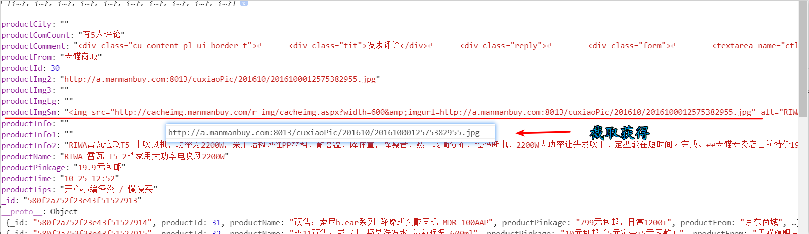

# 慢慢买项目文档

# 1  项目准备：

## 1.1  在线地址

[慢慢买在线项目](http://m.manmanbuy.com/)


## 1.2  如何使用git提交项目

[在线教学](https://blog.csdn.net/sinat_20177327/article/details/76062030)


## 1.3  如何使用md编辑

[献给写作者的 Markdown 新手指南](https://www.jianshu.com/p/q81RER)


1.4  项目分工
-------
| 负责人  | 负责页面          |
| ---- | ------------- |
| 伍楚盈  | 国内折扣页面        |
| 余仁平  | 省钱控页面、 商城导航页面 |
| 张佩茵  | 首页            |
| 彭帅   | 凑单品           |
| 蔡志亮  | 比价搜索页面、 白菜价页面 |
| 丁增杭  | 品牌大全页面、海淘折扣   |
| 朱凯波  | 优惠卷页面         |


# 2  技术总结

> 目录

[一、zepto.js](#一zeptojs)

[二、fastclick.js](#二fastclickjs)

[三、模板引擎的使用](#三模板引擎的使用)

[四、图片懒加载的使用](#四图片懒加载的使用)

[五、jQuery load() 方法](#五jquery-load-方法)

## 一、zepto.js

### 1.1  描述

被称为移动端的**jquery**

### 1.2  在线地址

- [下载地址](https://github.com/madrobby/zepto)
- [中文API](http://www.css88.com/doc/zeptojs_api/)

### 1.3  体验

> 1.引入js文件


> 2.像jquery一样进行使用

```html
<!DOCTYPE html> <html lang="en"> <head> <meta charset="UTF-8"> <meta name="viewport" content="width=device-width, initial-scale=1.0,maximum-scale=1,minimum-scale=1,user-scalable=no"> <title>03-zepto.html</title> <style> div{ width: 200px; height: 200px; background-color: aqua; margin: 100px auto; } </style> </head>
<body>
  <div></div>
  <!-- 引入zepto.js -->
  <script src="./zepto.js"></script>
  <script>
    // 绑定点击事件
    $("div").click(function () {
      // 链式编程 显示又隐藏
      $("div").hide().show();
    });
  </script>
</body>

</html>
```

### 1.4  模块化

> 不同于jquery将所有的代码都放入一个js文件中，zepto按照不同的模块拆分成了不同的js文件


> 当你在使用zepto的时候，出现了如以下报错的代码，那是提示你记得引入对应的模块

**xxx Is not a function**


### 1.5  定制zepto（了解）

> 如果我们需要引入zepto的很多模块的话，都单独引入反而变得麻烦


> 所以，最好是把一些常用模块打包到一个单独的zepto.js文件中

其实github也有[定制](https://github.com/madrobby/zepto#building) 的介绍

#### 1.5.1  定制zepto的步骤

1. 下载nodejs   [下载地址](http://nodejs.cn/download/)

2. 安装nodejs   [安装说明](https://www.runoob.com/nodejs/nodejs-install-setup.html)

3. github下载zepto项目

4. 在zepto文件中，打开命令行工具 （shift+鼠标右键）

5. 在命令行工具中输入  `npm install`  等待安装完成  

6. 打开目录下的`make`文件，找到第41行

7. ​    在命令中输入`npm run-script dist`开始定制

8. 找到根目录的`dist`文件夹，所生成的zepto.js就是我们自己定制的zepto

   

   ​

## 二、fastclick.js

> 通过组合处理mousedown,mouseup,click等事件解决click点击事件在移动端上的延迟。

### 2.1  使用步骤

#### 2.1.1 引入JS文件，注意，需要在body的上面引入

```js
<head>
  <meta charset="UTF-8">
  <meta name="viewport" content="width=device-width, initial-scale=1.0,maximum-scale=1,minimum-scale=1,user-scalable=no">
  <title></title>
  <!-- 引入fastclick.js  -->
  <script src="./fastclick.js"></script>
</head>
```

#### 2.1.1  初始化代码

```js
    if ('addEventListener' in document) {
      document.addEventListener('DOMContentLoaded', function () {
        FastClick.attach(document.body);
      }, false);
    }
```

#### 2.1.2  绑定click点击事件

```
document.querySelector("div").onclick=function(){}
```

 

## 三、模板引擎的使用

> 1、预备知识点：  

### 3.1  script标签的特点是：

- innerHTML 永远不会显示在界面上
- 如果 type 不等于 text/javascript 的话，内部的内容不会作为 javascript执行

### 3.2  模板引擎的使用

> 选择一个模板引擎

[推荐]https://github.com/tj/consolidate.js#supported-template-engines

> 2、下载模板引擎JS文件  

template-web.js

> 3、引入到页面

```js
<script src="/static/assets/vendors/art-template/template-web.js"></script>
```

> 4、准备一个模板 (联系script标签的特点)

```js
<!-- 准备一个模板引擎 -->
  <script type="text/x-art-template" id="tmpl">
    {{each comments}}
    <tr>
      <td class="text-center"><input type="checkbox" value="{{$value["post_id"]}}"></td>
      <td>{{$value["title"]}}</td>
      <td>{{$value["nickname"]}}</td>
      <td>{{$value["cat_name"]}}</td>
      <td class="text-center">{{$value["created"]}}</td>
      <td class="text-center">{{$value["status"]}}</td>
      <td class="text-center">
        <a href="javascript:;" class="btn btn-default btn-xs">编辑</a>
        <a href="javascript:;" class="btn btn-danger btn-xs">删除</a>
      </td>
    </tr>
    {{/each}}
  </script>
```

> 5、准备一个数据

```js
   $.ajax({
    dataType:"json",
    type:"get",
    url:"../api/getPosts.php",
    data:{
      cat_id:cat_id,
      status:status
    },
    success:function(res){
      if (res.code == 200) {
        console.log("请学会给自己找麻烦");
        var data = res.data;
        //调用模板引擎渲染数据
        var context = {comments:data}
        //借助模板引擎的api
        var html = template('tmpl',context);
        //将渲染结果的html设置到默认元素的innerHTML中
        $("tbody").html(html);
        // 重新绘制分页导航
        pageList(res.pageCount);
      }
    },
    error:function(){
      console.log("失败");
    },
    complete:function(){}
  });
  });
```

> 6、通过模板引擎的js提供大的一个api将模板整合得到渲染结果HTML

```js
  //调用模板引擎渲染数据
  var context = {comments:data}
  //借助模板引擎的api
  var html = template('tmpl',context);
```

> 将渲染结果的HTML设置到默认元素的html中

```js
 //将渲染结果的html设置到默认元素的innerHTML中
          $("tbody").html(html);
```

### 3.2  模板引擎扩展

> 补充1、** 模板引擎中的if语句

```js
 <td class="text-center">
  {{ if $value["status"] == 'drafted'}}
    草稿
    {{ else if $value["status"] == 'piblished' }}
      已发布
    {{ else }}
      已作废
  {{ /if }}
 </td>
```

> **补充2、** 模板引擎不需要循环遍历下的情况

- 服务端返回数据格式

```php
//执行sql语句
$data = read($sql,"bx");

//判断是否查询成功
if ($data) {
    $response = ['code'=>200,'message'=>'提取成功','data'=>$data];
} else {
    $response = ['code'=>-1,'message'=>'提取失败'];
}

echo json_encode($response);
```

- 客户端获取响应数据

```js
$.ajax({
  dataType:"json",
  type:"get",
  data:{page:page},
  url:"../api/getComments.php",
  success:function(res){
    console.log(res);
    //模板所需数据
    var context = {comments:res.data}
    //借助模板引擎的api
    var html = template('tmpl',context);
    console.log(html);
    //将渲染结果的HTML设置到默认元素的 innerHTML 中
    $("tbody").html(html);

    //绘制分页导航
    $('#pagination-demo').twbsPagination({
      totalPages: 10,//分页页码的总页数
      visiblePages: 7,//展示的页码数
      initiateStartPageClick:false, // 取消默认初始点击
      onPageClick: function (event, page) {
        getComments(page);
      }
});
```

- **重点:** 准备模板

```js
<script src="/static/plugins/jquery.twbsPagination.min.js"></script>
<script type="text/x-art-template" id="tmpl">
  {{each comments}}
  <tr>
    <td class="text-center"><input type="checkbox"></td>
    <td>{{$value.author}}</td>
    <td>{{$value.content}}</td>
    <td>{{$value.title}}</td>
    <td>{{$value.created}}</td>
    <td>{{$value.status}}</td>
    <td class="text-center">
      <a href="post-add.php" class="btn btn-info btn-xs">批准</a>
      <a href="javascript:;" class="btn btn-danger btn-xs">删除</a>
    </td>
  </tr>
  {{/each}}
</script>
```

<<<<<<< HEAD
## 四、图片懒加载的使用

### 4.1  插件推荐

> 为什么要使用这个技术

- 比如一个页面中有很多图片，如淘宝、京东首页等等，如果一上来就发送这么多请求，页面加载就会很漫长，如果js文件都放在了文档的底部，恰巧页面的头部又依赖这个js文件，那就不好办了。更为要命的是：一上来就发送百八十个请求，服务器可能就吃不消了（又不是只有一两个人在访问这个页面）。
- 因此优点就很明显了：不仅可以减轻服务器的压力，而且可以让加载好的页面更快地呈现在用户面前（用户体验好）。

[jq插件推荐](https://blog.csdn.net/qq947289507/article/details/81248721)

### 4.2  截取字符串重点

```js
for (var i = 0; i < res.length; i++) {
  var startIndex=res[i].productImg.indexOf("\"");
  var endIndex=res[i].productImg.indexOf("\"",startIndex+1);
  var ssrrcc= res[i].productImg.slice(startIndex+1,endIndex);
  console.log(ssrrcc)
}
```


### 4.3  JavaScript indexOf() 方法

#### 4.3.1  描述

> indexOf() 方法可返回某个指定的字符串值在字符串中首次出现的位置。
>
> 如果没有找到匹配的字符串则返回 -1。

#### 4.3.2  语法

```js
string.indexOf(searchvalue,start)
```

#### 4.3.3  参数值

| 参数            | 描述                                       |
| ------------- | ---------------------------------------- |
| *searchvalue* | 必需。规定需检索的字符串值。                           |
| *start*       | 可选的整数参数。规定在字符串中开始检索的位置。它的合法取值是 0 到 string Object.length - 1。如省略该参数，则将从字符串的首字符开始检索。 |

#### 4.3.4  返回值

| 类型     | 描述                                 |
| ------ | ---------------------------------- |
| Number | 查找指定字符串第一次出现的位置，如果没找到匹配的字符串则返回 -1。 |

### 4.3.5  示例代码

> 切割获取服务器返回的中的src属性对应的值

```js
var startIndex=res[i].productImg.indexOf("\"");
var endIndex=res[i].productImg.indexOf("\"",startIndex+1);
var ssrrcc= res[i].productImg.slice(startIndex+1,endIndex);
data[i]["productImg2"] = src;
```



> html 代码

```html

```

> 渲染模板之后初始化

```js
//调用模板引擎渲染数据
var context = {
  comments: data
}
//借助模板引擎的api
var html = template('tmpl', context);
//将渲染结果的html设置到默认元素的innerHTML中
$(".contnetUl").html(html);

//初始化
$("img.lazy").lazyload({
  effect: "fadeIn"
});
```

> **重点**

**记得在模板引擎中，图片渲染完毕后初始化**


## 五、jQuery load() 方法


> 入口函数建议传参($)，因为这样是局部变量，直接引用jq对象，不用一层一层往上找

```js
$(function ($) {})
```


### 5.1  描述

> jQuery load() 方法是简单但强大的 AJAX 方法。
>
> load() 方法从服务器加载数据，并把返回的数据放入被选元素中。

### 5.2  语法

```js
$(selector).load(URL,data,callback);
```

- 必需的 *URL* 参数规定您希望加载的 URL。
- 可选的 *data* 参数规定与请求一同发送的查询字符串键/值对集合。
- 可选的 *callback* 参数是 load() 方法完成后所执行的函数名称。


#### 